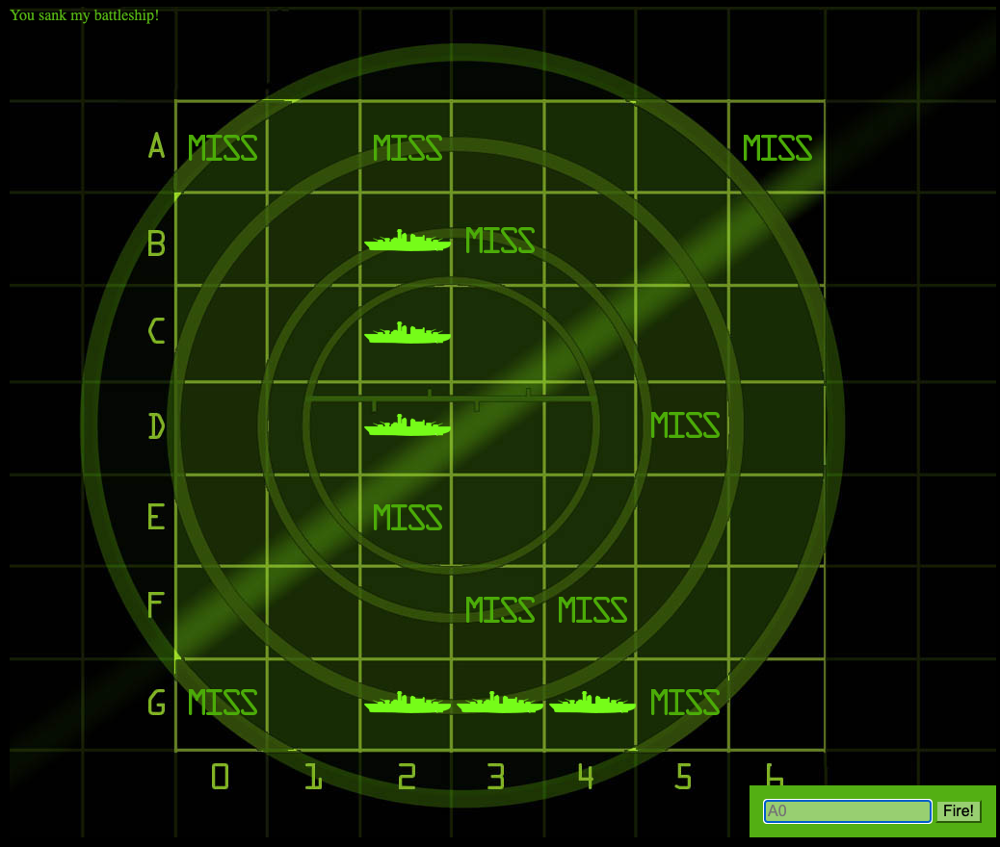

# Battleship Game 

Battleship game to learn about MVC (Model–View–Controller) pattern

Credit to this book for the brain friendly explanation 👉 [Head First Javascript](https://www.oreilly.com/library/view/head-first-javascript/9781449340124/) 

Created with   **Javascript** 

